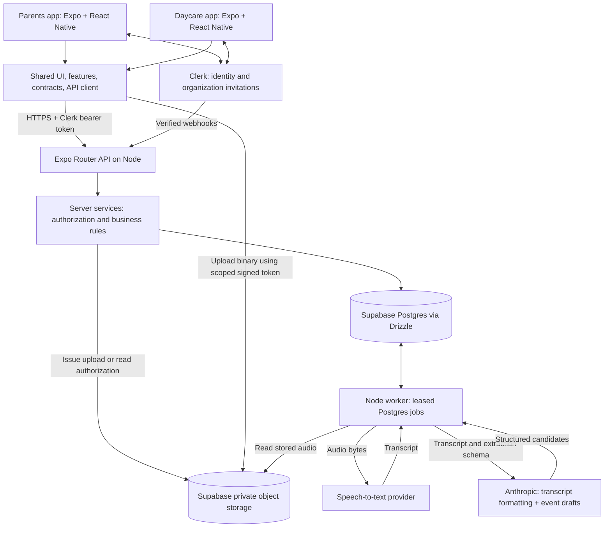
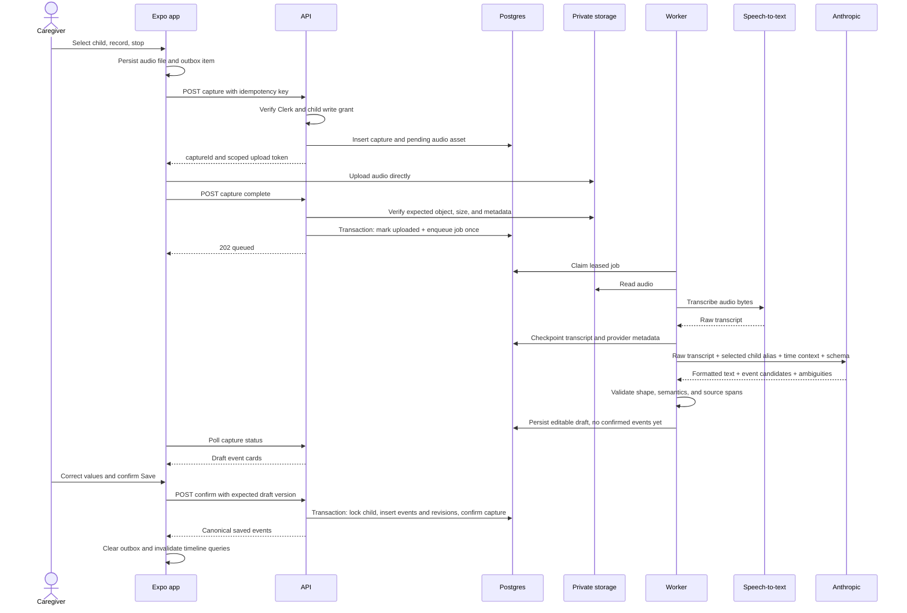
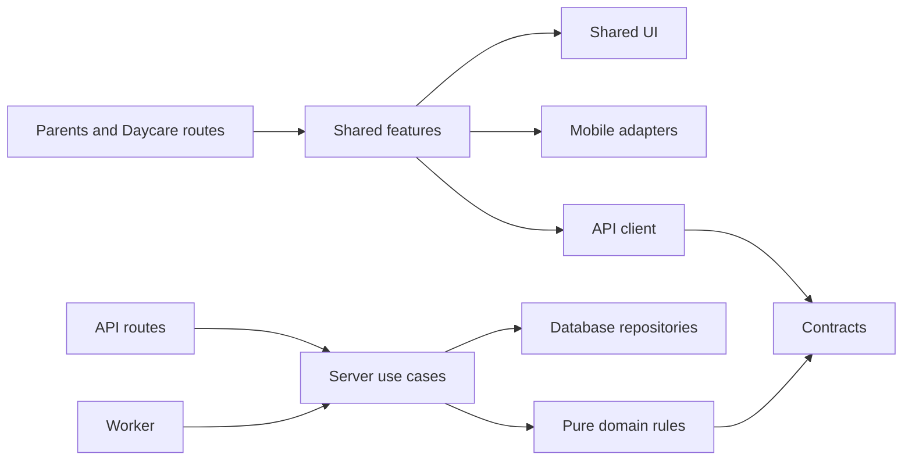

# Handoff: architecture blueprint

Prepared September 5, 2026. Status: proposed implementation contract.

## 1. Principal recommendation

Build a **caregiver handoff product with a lightweight journal**. Its main question is: **“What do I need to know before I take over?”**

Use a TypeScript modular monolith: two thin Expo clients, one Expo Router API deployment, one background worker, and one Supabase Postgres database. Shared UI and features live in packages; neither app imports the other app.

Start with a small daycare pilot: one location, a few children, named staff accounts, and invited guardians. The Parents app also supports household workspaces, using the same child journal and handoff features. Maintain both app shells, but validate one customer workflow first. This is a prototype that can fit a focused weekend; production daycare rollout requires more operational work than that.

### Decisions to preserve during implementation

| Area | Decision | Reason |
| --- | --- | --- |
| Tenancy | A workspace represents a household or one daycare location | Gives every child and record an unambiguous access boundary |
| Authentication | Clerk users and Organizations; application authorization in Postgres | Invitations and identity stay with Clerk; child permissions remain explicit |
| User IDs | Local UUID plus unique Clerk string ID | Stable local foreign keys without recreating authentication |
| Care relationships | Per child and per workspace, never a global user role | Someone can be a parent for one child and caregiver for another |
| Concurrent care | Multiple caregivers can have active sessions | Shared care is normal, especially in daycare |
| Handoff | Recipient reviews a bounded brief, then explicitly acknowledges and starts care | Opening an app is not a reliable handoff signal |
| Recording | One selected child per recording; multiple events per recording | Avoids guessing which child speech refers to |
| AI | Speech-to-text provider, then one Anthropic extraction/formatting call | Audio transcription is a separate capability; one extraction pass limits latency and drift |
| Event truth | AI creates drafts; user confirms facts | Numbers and dates need a correction path |
| Brief truth | Deterministic rendering of confirmed event revisions | Every displayed fact has a traceable source; generation outages cannot block taking care |
| Storage | Supabase private object storage first | Already in the stack; swap via a small storage interface if cost requires it |
| Synchronization | API queries plus foreground polling; local upload outbox | Avoids introducing two authorization paths or unreliable mobile background processing |
| Jobs | Postgres job table and a separate Node worker | Durable retries without Redis or an additional queue service |

## 2. Product scope and market hypothesis

The Reddit thread contains both appreciation for remembering care activities and concerns about effort, anxiety, and privacy. Treat this as qualitative evidence of different needs, not proof of product-market fit or daycare demand. Its strongest architectural implication is to support selective logging and a useful brief even when the journal is incomplete. [Referenced discussion](https://www.reddit.com/r/newborns/comments/1w89jor/logging_everything/)

Voice entry alone is already offered by Huckleberry, including multiple activities in one utterance. Brightwheel already has activity feeds, media, and daily reports. Handoff needs a demonstrable advantage in transition speed and clarity, rather than a claim that these capabilities are new. [Huckleberry voice logging](https://huckleberrycare.com/blog/huckleberry-ai-chat), [Brightwheel activity feed](https://help.mybrightwheel.com/en/articles/942392-view-your-child-s-activity-feed)

**Initial hypothesis:** staff and guardians will use a short, acknowledged transition brief if it takes less effort than their current pickup conversation, paper sheet, or message thread. Small providers are a discovery segment, not an established winning market.

Pilot workflow:

1. An owner creates a workspace and child and invites another caregiver.
2. A caregiver selects the child and taps **Start care**.
3. During care, they record short observations, review extracted event cards, and save.
4. The next caregiver opens **Catch me up**, reviews updates, and taps **I've read this — start care**.
5. The outgoing caregiver ends their own session. Overlap is allowed.

At daycare pickup, an invited guardian can read the child's brief in the Parents app. A care session records a person's declared app status; it is not attendance, legal custody transfer, or a pickup authorization system.

MVP includes account creation, child onboarding, invitation acceptance, manual/text logging, voice drafts, feed/diaper/sleep/milestone/note events, concurrent sessions, recipient-specific briefs, and optional photo or short video attachments.

Defer room assignments, bulk multi-child recording, attendance, billing, medical recommendations, messaging, push delivery, automatic media interpretation, and automatic synchronization between household and daycare journals. Home and daycare child profiles are deliberately workspace-specific until an explicit cross-workspace sharing model is designed. A guardian can access the daycare profile from the Parents app without copying it.

## 3. System architecture



### Runtime and deployment boundaries

- `apps/parents` and `apps/daycare`: separate Expo Router apps, bundle identifiers, themes, and navigation. NativeWind styles shared components.
- `apps/api`: Expo Router `+api.ts` handlers exported and served on Node through the Expo server Express adapter. Express is a hosting adapter only; business routes stay in Expo Router.
- `apps/worker`: a separately supervised Node process, sharing server packages. It processes transcription/extraction, validates attachments, and runs cleanup/reconciliation jobs.
- API and worker can run on the same development machine or small Node host. They are separate process lifecycles so an HTTP response does not terminate work. Hosted compute is an additional operating cost; free storage does not imply a free always-on backend.
- Supabase holds Postgres and private objects. Drizzle and database credentials exist only in server packages. Use a pooled connection appropriate to the deployment; with transaction pooling, disable prepared statements as documented by Drizzle.
- Use an explicit HTTPS `EXPO_PUBLIC_API_URL` in both native apps. Do not assume a phone can call its own `localhost` or that API files run inside a native binary.
- Pin a compatible stable Expo/React/React Native/NativeWind/tooling set in the lockfile. Milestone 1 must prove the exported API runtime can connect to Postgres and verify Clerk tokens; Expo documents its third-party hosting adapters as unofficial or experimental.

These deployment choices follow the [Expo API route and adapter documentation](https://docs.expo.dev/router/web/api-routes/) and [Drizzle Supabase connection guide](https://orm.drizzle.team/docs/connect-supabase).

### Identity, tenancy, and invitations

Clerk is authoritative for identity and Organization membership. Each workspace has one `clerk_org_id`. Local `users` and `workspace_memberships` are projections used for joins, auditing, and access checks. Local `child_caregivers` grants child access; being in a daycare organization does not grant every child.

Use Clerk organization invitations sent from the server, with an HTTPS acceptance landing page in `apps/api`. That landing page handles Clerk's web sign-in/acceptance flow, then offers a verified app/universal link into either client. Support an existing account and someone installing the app after accepting. Do not put child details or role authority in the URL. Clerk supports server-side redirect URLs and invitation metadata. [Clerk organization invitations](https://clerk.com/docs/guides/organizations/add-members/invitations)

Persist a local invitation intent before contacting Clerk. It holds the intended child grants and app role; Clerk carries only an opaque intent ID. An accepted Clerk membership is necessary but does not automatically turn caller-supplied metadata into child grants. A verified webhook or explicit server reconciliation checks the organization, invite identity, accepted membership, and stored intent, then applies grants idempotently.

Clerk and Postgres cannot share a transaction. Use intent states `pending_send → sent → accepted`, plus `revoked`, `expired`, and `reconcile_needed`. On an ambiguous send timeout, reconcile with Clerk before resending. Deduplicate webhook delivery by provider event ID; fetch current membership state before applying delayed events. A user can call `/bootstrap` after sign-in to reconcile without waiting for a webhook.

Map Clerk administrator/member/custom roles to the application's `owner | staff | caregiver | guardian` roles through server-owned configuration. Household caregivers need write grants; daycare guardians are read-only by default. A workspace owner grants staff specific children; the owner can manage all children in that workspace.

**Daycare roster privacy:** Clerk's default member role includes organization member/billing read permissions. Configure a minimal custom guardian role with those permissions removed, and test Clerk's own frontend endpoints as well as Handoff's API. Custom production roles can require Clerk's paid B2B add-on; include that in pilot economics. Hiding the roster in React components is insufficient. [Clerk roles and permissions](https://clerk.com/docs/guides/organizations/control-access/roles-and-permissions)

Membership revocation through Handoff blocks local access immediately, then updates Clerk durably. Dashboard-side Clerk changes are eventually reflected by verified webhooks and reconciliation; document that delay. Require live Clerk membership verification on `/bootstrap`, invitation/admin operations, and after stale membership sync, with a target maximum local verification age of 60 seconds for child requests. If freshness cannot be established, deny rather than granting stale access. Every request also checks local active membership and child permission. Revocation purges user-specific caches on the next successful sync; signed media URLs have their own remaining lifetime.

## 4. Recording-to-database flow



Each transition has durable storage. If the app closes after upload, the worker still finishes. If the response is lost after confirmation, retrying the same key returns the previously created event IDs.

### Transcription and extraction contract

Use `expo-audio` for recording, with explicit permission handling, recording indicators, interruptions, and a 60-second product limit. Persist the stopped file in app document storage before reporting that it is saved locally. [Expo audio](https://docs.expo.dev/versions/latest/sdk/audio/)

Anthropic's documented model interface supports text and image inputs; do not design the pipeline around sending a recording directly to Claude for transcription. Add `TranscriptionProvider`, with Deepgram prerecorded transcription as the initial proposed adapter. This adds a third-party API and usage cost to the requested stack. Typing or system keyboard dictation is the fallback if that provider is unavailable. [Claude model capabilities](https://platform.claude.com/docs/en/models/overview), [Deepgram prerecorded transcription](https://developers.deepgram.com/docs/pre-recorded-audio)

Make **one Anthropic call** return both formatted text and structured event candidates. Both derive from the raw transcript. Do not run extraction over only an earlier model rewrite: that can compound lost or invented details. Use native structured output support, then validate with Zod and domain rules; valid JSON does not prove factual correctness. Pin the chosen supported model ID in server configuration and promote model/prompt changes only after evaluation. [Anthropic structured outputs](https://platform.claude.com/docs/en/build-with-claude/structured-outputs)

Input: raw transcript, recording start time, IANA timezone, locale, selected child alias, schema version. Do not send the child's birthdate, membership list, or historical journal for this task. Treat the transcript as untrusted quoted data, not model instructions. The extractor has no tools and cannot perform writes.

Output: `formattedText`, zero or more candidates, source quote/spans, and explicit ambiguity flags. One recording can create several events; silence can create none. A mention of another child requires review and cannot choose another database child ID.

Examples:

| Speech | Candidate behavior |
| --- | --- |
| “Fed 60 ml at 2 am” | Feed, 60 ml; propose a date in recording timezone and show it for confirmation |
| “Fed at 2 am” | Feed with unknown amount; never invent zero or a typical bottle size |
| “Baby had poop a lot” | Diaper, stool observed, qualitative quantity “a lot”; no invented count |
| “First word, Dada” | Milestone with reported quote; “first” is the caregiver's report, not independently established |
| “Did not feed yet” | Must not create a completed feeding event |
| “Give 60 ml later” | Future note/planned statement; must not become a completed feeding |
| “Fed 60, no, 90 ml” | Explicit correction reflected in review; preserve the source |
| “At two” | Ask for AM/PM/date in review; do not silently pick one |

Dates and quantities are editable before saving. No time spoken means `occurred_at = null`, `time_precision = unknown`; the UI can say “reported at 14:10,” not “happened at 14:10.” Explicit “now” uses recording time with `time_precision = approximate`. Capture time, upload time, and event time remain distinct. Resolve local dates, midnight, and daylight-saving ambiguity in domain code and surface uncertainty to the user.

### Durable work and failure rules

- Jobs have a deduplication key, attempt count, availability time, lease token, lease expiry, and checkpoint. Claim with `FOR UPDATE SKIP LOCKED`; commit the claim before external calls.
- Worker writes require the current lease token, preventing an expired worker from overwriting a newer attempt. Heartbeat long jobs. A crashed lease becomes claimable again.
- Persist transcription before extraction so an extraction retry need not retranscribe. Never hold a database transaction open during an AI request.
- Retry transient network errors, 429s, and 5xx responses with jitter, respecting `Retry-After`. Use three automatic attempts, then a visible retry/manual-entry option. Permission errors and invalid files are terminal.
- Recheck that the workspace, child, capture, and creator's applicable grants remain active before committing a draft. Confirmation always reauthorizes the caller.
- Jobs provide at-least-once execution. Unique constraints and transactions give one set of saved events; they do not guarantee the provider is billed only once after a timeout.
- Two different recordings describing the same real-world feeding are a separate problem from request retries. Flag possible duplicates for review based on child, type, time, and amount; never silently merge them or assume two similar feeds are one. MVP can present adjacent timeline entries for user correction before adding automated duplicate suggestions.
- When offline, recordings remain **Saved on this device — awaiting upload**. Sync on foreground/reconnect. Do not promise mobile background execution or advance a handoff cursor offline.

## 5. Handoff semantics and race conditions

### Separate three concepts

| Concept | What it means | Storage |
| --- | --- | --- |
| Care session | A named caregiver says they are currently caring for this child | `care_sessions` |
| Event history | Confirmed observations and their corrections | `events`, `event_revisions` |
| Handoff acknowledgement | This recipient reviewed a specific journal snapshot | `handoff_briefs`, `handoff_cursors` |

Allow A and B to care simultaneously. Enforce at most one open session **per child and user**, using a partial unique index. Double taps return the same session. Ending A's session never ends B's session. Offline session starts stay pending until accepted by the API.

The default trigger is recipient initiated. **Start care** first shows **Since your last handoff**, then **I've read this — start care** creates the session and advances that recipient's cursor in a transaction. **Catch me up** can be opened without starting care. Opening or generating a brief does not acknowledge it. An outgoing caregiver can simply end their session; an explicit offer/accept transfer workflow can be added later if pilot evidence requires it.

Do not claim to know physical absence from app usage. Label the time boundary accurately. For a first visit, show “First handoff — recent history” with a disclosed 24-hour initial window and older-history link. Later visits show all unacknowledged changes, grouped/paginated when large. No silently truncated brief may advance the cursor past hidden pages.

### Why timestamps alone are insufficient

A feeding at 02:00 may be uploaded at 09:05, after a recipient read a brief at 09:00. Filtering only by `occurred_at > last_handoff_at` loses it. Corrections to yesterday's feed also matter today.

Each child has a `journal_seq` counter. Every confirmed create, correction, deletion, or published attachment update:

1. Locks that child's row with `FOR UPDATE`.
2. Increments its counter in the same transaction.
3. Inserts an immutable `event_revisions` snapshot with that sequence.
4. Updates the event's current projection and commits.

Use this locked counter, not a global sequence allocated before commit. For this child, the counter and its revisions become visible together. The recipient cursor stores the last acknowledged sequence. Candidates in an unfinished recording do not increment it.

### Brief generation and acknowledgement

```mermaid
sequenceDiagram
    actor R as Receiving caregiver
    participant A as API
    participant D as Postgres

    R->>A: POST child handoff brief
    A->>D: Repeatable-read transaction: cursor L, journal counter H
    A->>D: Read revisions with L < seq <= H and authorized context
    A->>D: Save immutable brief snapshot and source revision IDs
    A-->>R: Brief through H, pending recordings warning, current sessions
    Note over R,D: A new confirmed record may arrive with seq H+1
    R->>A: POST brief acknowledge-and-start
    A->>D: Lock child then recipient cursor; recheck authorization
    A->>D: Advance cursor to max(current,H); open own session if absent
    A-->>R: Acknowledged through H; newer updates remain unread
```

- A brief belongs to one recipient and one child. Another user cannot acknowledge it.
- Generate facts from confirmed revisions. Collapse repeated edits to one event within the window, with “updated” or “removed” labels. Keep all source revision IDs in the snapshot for traceability.
- Render every changed event, using a short priority section plus remaining updates. Known feed times, sleep intervals, diapers, notes marked “important,” and milestones use deterministic templates. “No feeding logged” must never become “The child was not fed.”
- A latest-known feed outside the change window can appear as explicitly labeled context, citing its source and age. It does not count as a new update.
- Include a visible count of server-known pending recordings. The server cannot know about another device's unsent offline files; label completeness accordingly. When those records are confirmed later, their new sequence puts them in the next brief.
- Do not filter out records merely because the recipient was active when they were logged or authored them. Completeness is more useful than silently guessing what someone remembers.
- Existing brief source snapshots are stable through ordinary edits. New edits produce new revisions. Deletion/privacy purge can invalidate or redact stored briefs; recheck access on every fetch and never serve a previously cached revoked record as current truth.
- If a brief becomes stale while open, show “New updates available.” Acknowledging it consumes only its cutoff, not the newest counter. Older acknowledgements cannot move the cursor backward.
- MVP brief prose is template-generated. Optional later Anthropic wording can operate over the same snapshots, but it must preserve source mapping and fall back to templates. It must not be required to start care.

## 6. Media and object lifecycle

Use a private Supabase bucket and store `storage_provider`, `bucket`, and `object_key`. `s3_storage_key` alone unnecessarily couples the schema to a provider and omits the bucket. Never store signed URLs as permanent identifiers.

Supabase currently lists 1 GB storage on its Free plan and a maximum free-project upload limit of 50 MB. That is enough for a bounded prototype, not sustained daycare video. The plan also has egress limits and inactivity pausing. [Supabase pricing](https://supabase.com/pricing), [Upload limits](https://supabase.com/docs/guides/storage/uploads/file-limits)

Product limits: audio up to 60 seconds/10 MB; image up to 5 MB; video up to 15 seconds/20 MB; at most three attachments per capture. These are application choices, enforced server-side, below provider maxima. Resize images and strip image location metadata before upload; inspect/normalize uploaded files on the worker before publication. Reject unsupported video encoding and oversized clips with an actionable message; adaptive streaming and transcoding are deferred.

Object key: `workspaceId/childId/captureId/assetId.ext`, generated by the server. Names contain IDs, not child names. Upload tokens authorize exactly the allocated object; no overwrite/upsert. Bucket limits enforce upload MIME/size constraints, and worker byte/container inspection verifies that the declared content is real. Never let clients supply arbitrary storage paths or external fetch URLs.

Media state: `pending_upload → uploaded → ready`, with `rejected`, `deleting`, and `deleted` branches. Only ready assets may be signed for viewing. An attachment can be uploaded after the recording and even after confirmation; once validated, the server publishes new revisions for affected confirmed events. By default all events from that one-child capture reference its attachments. The brief shows the shared attachment once and links back to the capture.

Audio is source material, not a regular gallery attachment. Delete raw audio seven days after confirmation; mark unconfirmed abandoned captures for cleanup after seven days, with a visible expiry in the UI. Keep user-confirmed text/events until explicit deletion or workspace retention policy. Purge abandoned upload objects after 24 hours and reconcile objects uploaded without completion callbacks. The cleanup process must use the storage API, not just delete database metadata.

Issue read URLs only after fresh API authorization, with a proposed 60-second TTL. Already-issued URLs can remain usable until expiry even after membership revocation, so access removal is not instant for those URLs. Do not claim otherwise or log URLs. [Supabase signed downloads](https://supabase.com/docs/guides/storage/serving/downloads)

Track reserved plus stored bytes per workspace and reject new uploads before exceeding its configured budget. As an illustrative capacity estimate, 20 children × 2 photos/day × 0.5 MB × 30 days is about 600 MB before audio/video. Use observed pilot sizes to adjust limits. If storage becomes the bottleneck, implement a second `ObjectStorage` adapter and migrate provider/bucket/key references; do not add another storage provider before that need exists.

## 7. Application state management

| State | Owner | Rules |
| --- | --- | --- |
| Identity/session tokens | Clerk SDK + secure token cache | No token copies in Zustand or plain storage |
| Workspaces, children, timeline, drafts, sessions, briefs | TanStack Query | API is authoritative; invalidate after mutations |
| Recording controls, selected child/workspace, review UI | Zustand | Small transient state; reset on logout/workspace change |
| Local audio paths and queued uploads | Expo SQLite + app document files | Durable outbox keyed by user/workspace/child/capture |
| Form edits | Local form state + Zod | Save only through validated API mutations |

Query keys always include user ID, workspace ID, and child ID where applicable. Keep general server query cache in memory in MVP; persist only the minimum outbox/draft data needed to recover local recordings. Logout clears caches and removes that user's local files/outbox after a clear unsent-recordings notice. Account switching must never upload another account's recordings.

Poll an active capture every two seconds while processing, with backoff; poll a visible child journal every 10 seconds and refresh on focus/reconnect. Show last synced time. Server pagination uses opaque cursors; merge by canonical ID/version. Optimistically show a pending capture, but never optimistically show confirmed events, acknowledged handoffs, or granted permissions.

TanStack Query's cache is not the durable upload queue. Zustand is not the canonical event database. Use `expo-audio`, `expo-sqlite`, `expo-file-system`, secure token storage, image picker, and video playback packages compatible with the pinned Expo SDK. Shared native dependencies must resolve to a single React/React Native version; use Expo's workspace setup guidance. [Expo monorepos](https://docs.expo.dev/guides/monorepos/)

## 8. File and package architecture

```text
Handoff/
  apps/
    parents/                 # Expo routes, app config, household/guardian navigation
      app/
      src/
    daycare/                 # Expo routes, staff child list, daycare navigation
      app/
      src/
    api/
      src/app/               # Expo +api.ts handlers and invitation web landing
      server.ts              # Node hosting adapter only
    worker/
      src/index.ts           # Worker lifecycle, lease polling, shutdown
  packages/
    ui/src/                  # NativeWind primitives and presentational cards
    features/src/            # Shared onboarding, journal, recording, handoff screens/hooks
    contracts/src/           # Zod request/response and event schemas; no database imports
    domain/src/              # Pure permissions, time resolution, event rules, brief renderer
    api-client/src/          # Authenticated transport and typed query/mutation hooks
    mobile/src/              # Clerk/Query providers, recording adapter, local outbox
    db/src/                  # Drizzle schema, transactions, repositories; server only
    db/migrations/           # Generated SQL plus reviewed constraints/grants
    server/src/              # Use cases, verified auth, providers, job handlers; server only
    config/                  # Shared TypeScript/lint/style configuration
  tests/
    integration/             # Real Postgres authorization/concurrency/retry tests
    fixtures/                # Synthetic transcripts, audio, and expected facts
    e2e/                     # Device/user flows
  scripts/                   # Migrations, evaluations, pilot metrics
  docs/
```

Import direction:



Public packages must not import `db` or `server`, including through barrel exports. Enforce this with lint/build dependency checks. Each app owns its navigation and maps a shared screen's callbacks into Expo Router navigation. The shared feature does not import `apps/parents` or assume a particular route tree. Differences such as guardian read-only views are capability-driven UI, backed by the same server permission checks.

## 9. Reliability, security, and operating boundaries

- Verify Clerk token signature, issuer, expiry, and applicable authorized-party/audience rules on the server; derive the user from the verified subject. A requested workspace ID is a selection, not proof of membership.
- Put application tables in a non-exposed schema; disable the public Data API path for those tables. Runtime credentials are separate from migration credentials. All mobile data access goes through Handoff's API; direct object uploads/downloads use scoped authorization.
- Tenant RLS for the restricted API database role uses transaction-local verified workspace context; domain authorization additionally checks child grants. The API role cannot own tables or bypass RLS. Background services use explicit scoped transactions after trusted job dispatch. Drizzle does not automatically propagate a Clerk token into SQL authorization.
- Owner/admin access stays inside its workspace. Guardian reads require an active child link. All MVP confirmed events for a linked child are visible to its authorized readers; there is no hidden staff-note feature accidentally leaking through summaries.
- Restrict raw recordings/drafts to their author and authorized workspace owner; other caregivers receive only confirmed events. Check the parent capture's access for every asset URL.
- Put Clerk secret, webhook secret, database URL, storage service secret, transcription key, and Anthropic key only in API/worker environment variables. Only Clerk publishable key, API URL, and flavor flags are public.
- Keep telemetry free of names, birthdates, transcripts, media URLs, and token contents. Store request/job IDs, durations, statuses, token counts, audio seconds, bytes, and edit flags. AI request payloads are not debug logs.
- Show what is sent to transcription/AI services before a user first enables voice. Store the accepted processing-notice version. Support deleting a child and its objects, drafts, revisions, and brief snapshots through a durable purge job. Review each provider's actual data handling and backup retention before a real pilot; deleting local data is not a promise of provider-wide immediate deletion.
- Apply per-user/workspace quotas and provider spend caps. Manual event entry and deterministic handoff remain usable if AI is down or a voice quota is reached.
- Scheduled cleanup, queue-age alerts, storage usage, invitation reconciliation failures, and a tested database backup/restore procedure are rollout work, included in milestone 5. No medical decision engine is part of this design.

Supabase documents restricting or disabling exposed data schemas, and separately offers a Clerk third-party integration if direct client database access is deliberately introduced later. That integration is **not** a substitute for the API/Drizzle authorization model chosen here. [Supabase API security](https://supabase.com/docs/guides/api/securing-your-api), [Supabase Clerk integration](https://supabase.com/docs/guides/auth/third-party/clerk)

See [database and API contract](data-contract.md) for enforceable invariants and [implementation roadmap](implementation-roadmap.md) for build gates.
