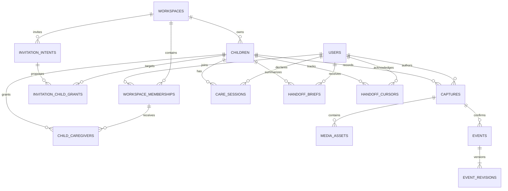

# Handoff: database and API contract

Read alongside [architecture](architecture.md). Names below are the authoritative logical schema for the implementing model; these are specifications, not executable migrations.

The [PII encryption contract](pii-encryption.md) defines physical encrypted columns and key handling. Clear values below describe decrypted domain/API payloads where specified; they must not be duplicated in plaintext database columns.

## 1. Schema conventions

- PostgreSQL UUIDs for application entities; Clerk IDs remain `text` (`user_…`, `org_…`). `users.id` is not a Supabase `auth.users` ID.
- Store queryable instants as `timestamptz` and workspace/capture timezones as IANA strings. Birthdate is a validated `YYYY-MM-DD` value inside encrypted profile data. All API instants use ISO 8601 UTC; include timezone separately for display and interpretation.
- Every tenant-owned row has `workspace_id`. Every child-owned row also has `child_id`. Composite foreign keys enforce workspace/child consistency, not just separate single-column references.
- Mutable entities have `created_at`, `updated_at`, and integer `version` starting at 1 unless noted. Immutable records have `created_at`. All timestamps are server assigned except explicitly identified capture/event times.
- All relationships below use foreign keys, indexed on lookup paths. Enumerations are constrained text or PostgreSQL enums, consistently selected in implementation. `?` means nullable.
- Relational columns hold query/access metadata, relationships, timestamps, and permissions. Personal profiles, amounts/details, drafts, source text, and snapshots use validated ciphertext envelopes in JSONB. Their decrypted payloads remain typed and versioned; no plaintext JSON copies are permitted.
- Persist a root `schemaVersion` in revision and brief snapshot JSON. Capture `schema_version` versions the draft payload. Payload versions are distinct from entity edit versions and prompt/model versions; retain compatible readers for supported old records.



This diagram shows the main relationships. The composite keys and infrastructure tables below remain part of the contract even where omitted from the diagram.

## 2. Identity and access tables

### `users`

`id uuid PK`, `clerk_user_id text UNIQUE NOT NULL`, `profile_ciphertext jsonb` (display name under user-scoped key), `status active|deleted`, `processing_notice_version text?`, `processing_notice_accepted_at timestamptz?`, timestamps.

This is a minimal identity projection. Clerk owns login methods, password/session data, and email verification. Do not add passwords or a global `parent` role. Display names can be refreshed through reconciliation; account deletion anonymizes attribution where records must be retained, while workspace/child deletion follows the purge policy.

### `workspaces`

`id uuid PK`, `clerk_org_id text UNIQUE NOT NULL`, `kind household|daycare`, `profile_ciphertext jsonb` (workspace name), `timezone text`, `status active|deleting|deleted`, `storage_budget_bytes bigint`, `storage_reserved_bytes bigint DEFAULT 0`, `storage_used_bytes bigint DEFAULT 0`, timestamps/version.

Onboarding creates an Organization using Clerk, then calls workspace initialization with its ID. The API verifies live creator/admin membership before materializing the workspace and initial owner. Retrying initialization returns the same workspace by `clerk_org_id`. An Organization created before app initialization finishes is reconciled on retry; it never grants access to another workspace.

### `workspace_memberships`

`workspace_id uuid FK`, `user_id uuid FK`, `clerk_membership_id text UNIQUE`, `app_role owner|staff|caregiver|guardian`, `status active|revoked`, `provider_verified_at timestamptz`, `revoked_at timestamptz?`, timestamps/version. PK `(workspace_id,user_id)`.

Local role is derived from a server-controlled Clerk role mapping and validated invitation intent. Do not accept it in an ordinary client profile update. Last-owner removal is rejected unless deleting the workspace or another owner is established. Revocation never deletes authored events as a side effect.

### `children`

`id uuid PK`, `workspace_id uuid FK`, `profile_ciphertext jsonb` (name and optional birthdate), `created_by_user_id uuid FK`, `journal_seq bigint DEFAULT 0`, `status active|archived|deleting|deleted`, timestamps/version. UNIQUE `(workspace_id,id)`.

Birthdate is optional to minimize onboarding effort; require it only if an actual product feature uses age. Reject future dates at the API. A child's profile belongs to one workspace. A guardian accessing a daycare profile does not become its owner.

### `child_caregivers`

`workspace_id uuid`, `child_id uuid`, `user_id uuid`, `relationship parent|relative|caregiver|other`, `permission reader|contributor|manager`, `status active|revoked`, `granted_by_user_id uuid`, timestamps/version. PK `(workspace_id,child_id,user_id)`.

FK `(workspace_id,child_id) → children(workspace_id,id)` and `(workspace_id,user_id) → workspace_memberships`. The relationship is descriptive; permission determines capabilities. App-role ceilings apply: a daycare guardian remains read-only even if an erroneous contributor grant exists. Only owners or approved managers can change grants, within their own scope.

### `invitation_intents`

`id uuid PK`, `workspace_id uuid FK`, `clerk_invitation_id text? UNIQUE`, `invitee_ciphertext jsonb` (normalized email), `email_lookup_hash bytea`, `email_lookup_key_id uuid FK data_keys`, `intended_app_role`, `invited_by_user_id uuid`, `status pending_send|sent|accepted|revoked|expired|reconcile_needed`, `accepted_by_user_id uuid?`, `expires_at timestamptz`, `accepted_at timestamptz?`, timestamps/version. UNIQUE `(workspace_id,id)`.

Partial unique index on `(workspace_id,email_lookup_hash)` for pending/sent/reconcile-needed invitations. The lookup value is a workspace-keyed HMAC, never a plain email hash. Resolve its key in the same workspace and follow the serialized lookup-key rotation procedure in the encryption contract. Keep encrypted email only where needed for invitation matching and management; clear according to retention policy. `expires_at` is enforced locally as well as any provider expiry. Cancelling locally blocks grants even if an old provider link is visited later.

### `invitation_child_grants`

`workspace_id uuid`, `invitation_intent_id uuid`, `child_id uuid`, `relationship`, `permission`. PK `(invitation_intent_id,child_id)`; composite FKs to intent and child.

Apply these to `child_caregivers` only after server reconciliation establishes the accepted Clerk membership and the invitation's verified recipient. Joining through another invite or editing public metadata cannot claim this intent. If the user already belongs to the workspace, owners can grant child access directly without pretending Clerk must invite the same organization member again.

## 3. Capture, storage, and event tables

### `captures`

`id uuid PK`, `workspace_id uuid`, `child_id uuid`, `author_user_id uuid`, `care_session_id uuid?`, `client_capture_id uuid`, `input_kind audio|text|manual`, `captured_at timestamptz`, `timezone text`, `locale text`, `content_ciphertext jsonb?` (raw transcript, formatted text, draft), `draft_version int DEFAULT 0`, `schema_version int`, `prompt_version text?`, `model_id text?`, `status awaiting_upload|queued|processing|needs_review|confirmed|failed|cancelled`, `error_code text?`, `confirmed_at timestamptz?`, timestamps/version.

UNIQUE `(workspace_id,author_user_id,client_capture_id)` and `(workspace_id,child_id,id)`. Optional care session must belong to the same child and author; logging does not require an active session. Text skips transcription; manual structured entry skips AI, creates a validated draft, and uses the same confirmation transaction. The author can modify/discard an unconfirmed draft. No other caregiver's brief may treat it as a fact.

The decrypted draft includes stable candidate IDs, source spans, field values, ambiguity flags, and discard flags. Unresolved time can be explicitly confirmed as unknown; invalid quantities cannot be confirmed. A confirmed capture is immutable as a source; later corrections update events and add revisions. Transcription checkpoints update the encrypted content with version checks; no raw text is copied into job metadata.

### `media_assets`

`id uuid PK`, `workspace_id uuid`, `child_id uuid`, `capture_id uuid`, `uploaded_by_user_id uuid`, `kind audio|image|video`, `storage_provider text`, `bucket text`, `object_key text`, `declared_mime text`, `verified_mime text?`, `reserved_bytes bigint`, `size_bytes bigint?`, `duration_ms int?`, `checksum text?`, `status pending_upload|uploaded|ready|rejected|deleting|deleted`, `expires_at timestamptz?`, timestamps/version.

UNIQUE `(storage_provider,bucket,object_key)` and `(workspace_id,child_id,id)`; composite FK to capture. Audio assets are restricted source material. Images/videos can be attached to confirmed events via revision snapshots after ready validation. Signed URLs are returned at request time, never stored.

Reserve storage bytes atomically before issuing an upload token; settle reservation to actual usage exactly once on validation. Release reservations on expiry/rejection, with object cleanup. Concurrent uploads cannot independently spend the same quota. Store cleanup state so retries cannot decrement totals twice.

### `events`

`id uuid PK`, `workspace_id uuid`, `child_id uuid`, `capture_id uuid`, `source_candidate_id uuid`, `created_by_user_id uuid`, `last_edited_by_user_id uuid`, `kind feed|diaper|sleep|milestone|note`, `occurred_at timestamptz?`, `ended_at timestamptz?`, `timezone text`, `time_precision exact|approximate|unknown`, `payload_ciphertext jsonb` (amount, unit, details), `important boolean DEFAULT false`, `status active|deleted`, `current_revision_id uuid`, timestamps/version.

UNIQUE `(capture_id,source_candidate_id)` prevents duplicate confirmation; UNIQUE `(workspace_id,child_id,id)` supports composite FKs. `events` is the current projection for timeline queries. There are no AI-only events hidden among confirmed facts.

Details are a discriminated union validated by the server:

| Kind | Details | Rules |
| --- | --- | --- |
| Feed | `method`: bottle, breast, solid, or unknown; optional description | Amount optional and positive if present; preserve stated unit; never infer nutritional adequacy |
| Diaper | `contents`: wet, stool, both, or unknown; optional qualitative quantity/note | “A lot” stays qualitative, not an integer count |
| Sleep | `state`: interval, started, or ended; optional note | An interval needs start/end; end cannot precede start; do not auto-pair ambiguous intervals |
| Milestone | `description`, optional `quote`, `reportedFirst: boolean` | Preserve reported wording and attribution |
| Note | `text`, `intent`: observation, planned, or question | Plans/questions cannot be rendered as completed care |

Database checks: `ended_at` requires `occurred_at` and is >= it; unknown occurrence implies unknown precision; required ciphertext envelope is present. Domain validation before encryption and after decryption enforces: amount/unit both null or both nonnull, positive amount with up to two decimal places within the original numeric(10,2) range, allowed unit (ml, oz, g, minutes), type-specific combinations, and reasonable bounds. PostgreSQL cannot inspect encrypted amount/details. Store canonical user-approved values; do not normalize away the original unit or source.

### `event_revisions`

`id uuid PK`, `workspace_id uuid`, `child_id uuid`, `event_id uuid`, `journal_seq bigint`, `event_version int`, `operation created|corrected|deleted|media_updated`, `actor_user_id uuid`, `content_ciphertext jsonb` (snapshot and optional source quote), `source_start int?`, `source_end int?`, `created_at timestamptz`.

UNIQUE `(child_id,journal_seq)` and `(event_id,event_version)`; composite FK to the event. Snapshot contains the event's canonical fields and ready image/video asset IDs, never credentials or signed URLs. It is validated against a versioned revision schema. Source spans refer to the raw transcript, not formatted text; null spans are permitted for manual entry.

Allocate event and revision IDs before insertion. Add UNIQUE `(workspace_id,child_id,event_id,id)` on revisions, then a DEFERRABLE INITIALLY DEFERRED FK from events `(workspace_id,child_id,id,current_revision_id)` to that key. The reverse revision-to-event composite FK enforces the same tenant/child. Insert both rows in one transaction and test rollback; no incomplete projection may become visible.

Only the event service may mutate the projection and append revisions. It locks the child row for every published change. Never patch `events` independently of a revision. An attachment published after capture confirmation creates `media_updated` revisions for its affected events under the same child lock.

Example of a **confirmed API event**, after the user has selected September 5 and confirmed the time:

```json
{
  "kind": "feed",
  "occurredAt": "2026-09-05T09:00:00Z",
  "timezone": "America/Vancouver",
  "timePrecision": "exact",
  "amountValue": "60.00",
  "amountUnit": "ml",
  "details": { "method": "unknown" },
  "sourceQuote": "Child fed 60ml at 2am"
}
```

The date and timezone are not inferable from those words alone. The UI must show the proposed date before saving. Decimal quantities are represented as validated decimal strings in the encrypted payload and API, preserving exact user-approved values without binary floating-point conversion.

## 4. Sessions and handoff tables

### `care_sessions`

`id uuid PK`, `workspace_id uuid`, `child_id uuid`, `user_id uuid`, `started_at timestamptz`, `ended_at timestamptz?`, `end_reason user_ended|membership_revoked|child_archived?`, timestamps/version. UNIQUE `(workspace_id,child_id,user_id,id)` for capture validation.

Partial unique index `(child_id,user_id) WHERE ended_at IS NULL`; check end >= start. Server-confirmed start time is authoritative; optional device intent time may be kept as metadata without claiming an offline transfer happened. Revocation closes that user's active sessions with a reason, but does not change anyone else's session.

### `handoff_cursors`

`workspace_id uuid`, `child_id uuid`, `user_id uuid`, `acknowledged_seq bigint DEFAULT 0`, `last_acknowledged_brief_id uuid?`, `updated_at timestamptz`. PK `(workspace_id,child_id,user_id)`; composite FKs to child and membership.

Counter is monotonic and never exceeds an actually acknowledged brief's cutoff. Access revocation invalidates reads even if this row remains for audit. The initial-history exception below is explicit.

### `handoff_briefs`

`id uuid PK`, `workspace_id uuid`, `child_id uuid`, `recipient_user_id uuid`, `from_seq_exclusive bigint`, `through_seq_inclusive bigint`, `initial_window_start timestamptz?`, `snapshot_ciphertext jsonb`, `renderer_version text`, `status ready|invalidated|redacted`, `acknowledged_at timestamptz?`, `started_session_id uuid?`, `created_at timestamptz`.

Snapshot contains displayed entries, source event/revision IDs, deterministic text, context labels, pending-capture count at generation, and a disclosed initial-window policy if used. Check `0 <= from_seq <= through_seq`. An empty initial brief at counter zero is valid.

First handoff: select recently occurring **or recently confirmed/revised** entries from the past 24 hours, plus latest-known care context. Disclose omitted older history and require the acknowledgement label to say that this establishes the initial baseline. Only this explicit initial setup can skip historical pages while advancing to the current counter. Subsequent briefs cover every unacknowledged published change through their cutoff.

Brief generation uses a repeatable-read transaction so `through_seq`, source rows, context, and saved snapshot agree. Acknowledgement uses a transaction with a consistent lock order: child → recipient cursor → brief → session. Idempotent replay returns the same result. Do not hold locks while the user reads.

## 5. Infrastructure tables

These support failures in the main user flows; do not replace them with in-memory maps in a deployed build.

| Table | Fields and constraints | Purpose |
| --- | --- | --- |
| `jobs` | UUID PK; workspace/child/capture references as applicable; kind (process capture, validate media, purge, reconcile); unique dedupe key; status; payload IDs; checkpoint; attempts; available_at; lease_token; lease_expires_at; last_error_code; timestamps | Durable leased work. Payload references source rows instead of copying transcripts |
| `idempotency_requests` | Actor user ID, route operation, key; user/workspace encryption scope; keyed request fingerprint and key ID; response status plus encrypted canonical response; created_at/expires_at; PK `(actor_user_id,operation,key)` | Reauthorize replay; return same canonical effect; same key/different body returns 409; regenerate temporary URLs |
| `webhook_inbox` | Provider and event ID PK; minimal verified resource references/lifecycle facts; received_at; processing status; processed_at; retry count | Verify signature before inserting; reconcile current state; never keep raw PII webhook bodies |
| `audit_log` | UUID PK; workspace/child as applicable; actor; action; entity ID; request ID; created_at | Membership/grant changes, deletions, and handoff acknowledgements; omit raw sensitive content |
| `data_keys` | UUID PK; exactly one workspace/user FK; content/lookup purpose; version; wrapped key bytes; approved wrapping provider/key reference/context version; state; timestamps; one active key per scope/purpose | Envelope encryption key registry; raw keys and KEK are never stored in Postgres; full constraints in the encryption contract |

Keep infrastructure tables in a non-exposed internal schema. The dispatcher credential can claim queue entries but is not the mobile API credential. Worker use cases obtain workspace context from validated job records and use the same tenant-scoped repositories as the API. Purge has a separately constrained maintenance capability.

Idempotency response records may expire after a stated retry window (proposed seven days); semantic uniqueness on capture candidate IDs, active sessions, accepted invitations, and job dedupe keys continues protecting durable effects afterward. Insert idempotency results in the same transaction as business writes when both are database-only. External invite operations use persisted intent reconciliation rather than pretending they are atomic with Clerk.

## 6. Database access and index requirements

The mobile app has no SQL or PostgREST CRUD access. App tables are in a private schema; `anon` and `authenticated` do not receive table grants. Enable tenant RLS for the restricted server role with both `USING` and `WITH CHECK` conditions against transaction-local workspace context, and force RLS where appropriate. The workspace root compares its `id` to that context; tenant-owned tables compare `workspace_id`. Global identity and internal dispatcher tables use their separately limited grants/repositories. Missing context denies tenant access. Schema owner/migration credentials are never runtime credentials.

Every authorized request resolves `(user_id,workspace_id,child_permission)` first. Set tenant context with transaction-local `set_config(..., true)` inside a Drizzle transaction; never use connection-global settings with a pool. Child services still enforce child permissions because tenant RLS alone does not separate children within one daycare. This is an intentionally server-mediated model, not a claim of per-child RLS enforcement. Identity/bootstrap repositories have narrowly defined non-tenant lookup permissions for the verified Clerk subject.

Required indexes in addition to unique/FK indexes:

- Memberships `(user_id,status)`; child grants `(workspace_id,user_id,status,child_id)`.
- Children `(workspace_id,status)`.
- Events `(workspace_id,child_id,occurred_at DESC,id)` with a consistent null-time display ordering; revisions `(child_id,journal_seq)`.
- Captures `(workspace_id,child_id,status,created_at)` and `(author_user_id,status)`.
- Media `(status,expires_at)`; jobs `(status,available_at)` and leased-job expiry.
- Briefs `(workspace_id,child_id,recipient_user_id,created_at DESC)`.

Use composite FKs to block cross-tenant/cross-child references even if the API is buggy. Index declarations, partial indexes, deferred constraints, grants, and policies belong in reviewed migrations. Only the migrator applies schema changes; no application-startup `push` operation.

## 7. Permission matrix

All permissions below require active workspace membership. Owners have workspace-wide scope; everyone else also needs an active child grant.

| Action | Owner | Contributor caregiver/staff | Reader/guardian |
| --- | --- | --- | --- |
| Read confirmed journal/brief | Any child in workspace | Granted children | Granted children |
| Create draft and confirm own events | Yes | Yes | No |
| Read another author's raw draft/audio | Owner only | No | No |
| Correct/delete event | Any in workspace, audited | Own events; managers may correct within granted scope | No |
| Attach media | Authorized capture owner/owner | Own capture | No |
| Start/end care | Own session | Own session | Own session, as self-reported care |
| Acknowledge brief | Own recipient brief | Own recipient brief | Own recipient brief |
| Invite/change grants | Yes | Explicit manager grant, within scope and role ceiling | No |
| Delete child/workspace | Owner only | No | No |

A reader's self-reported care session does not upgrade their journal permissions. Staff-only note visibility is outside MVP; adding it requires event-level filtering of revision selection, snapshots, source links, and context, not just hiding cards.

## 8. HTTP contract

Base URL `/v1`. All endpoints except health, webhook verification, and invitation landing require a Clerk bearer token. Workspace is explicit in workspace-level paths or resolved from the requested child/capture/brief with an authorization check. JSON DTOs use camelCase. Unknown unauthorized resource IDs return a consistent 404; use 403 for forbidden operations on a resource the user can already see.

For all state-changing app requests, require a client-generated UUID `Idempotency-Key`; reject free-text keys that could contain personal data. For edits, also require `expectedVersion` (or `expectedDraftVersion`). Conflict returns `409` and the latest authorized version; no silent last-write-wins. Errors use `{code,message,requestId,retryable,fieldErrors?}` without stack traces or private payload values.

| Endpoint | Behavior |
| --- | --- |
| `GET /health` | Runtime readiness; no secrets |
| `POST /bootstrap` | Upsert local user by verified Clerk subject, reconcile eligible org memberships/invitations, return available workspaces |
| `POST /workspaces` | Verify supplied Clerk organization admin membership; initialize workspace and owner idempotently |
| `DELETE /workspaces/:workspaceId` | Owner only; mark workspace inaccessible and enqueue full purge; implemented in milestone 5 |
| `GET/POST /workspaces/:workspaceId/children` | List authorized children; owner/manager creates child and initial grants |
| `GET/PATCH/DELETE /children/:childId` | Read/update permitted profile fields; delete marks inaccessible and enqueues purge |
| `GET/PATCH /children/:childId/caregivers` | Scoped roster/grant management; enforce app-role ceilings |
| `GET/POST /workspaces/:workspaceId/invitations` | Owner/manager lists invitation status without addresses; POST persists intent/grants, asks Clerk to send, and returns the intent status |
| `GET/DELETE /invitations/:invitationId` | Authorized invitation status/revocation, with Clerk reconciliation |
| `DELETE /workspaces/:workspaceId/members/:userId` | Revoke locally, close sessions, audit, schedule Clerk removal |
| `POST /captures` | Allocate capture and optional audio asset/upload authorization; body includes selected child and stable client capture ID |
| `GET/PATCH /captures/:captureId` | Author/owner reads processing state or edits an unconfirmed draft with expected version |
| `POST /captures/:captureId/complete` | Verify audio object, commit upload state and unique job; text input can enqueue directly at creation |
| `POST /captures/:captureId/confirm` | Validate reviewed draft, lock child, insert zero or more events/revisions once, return canonical IDs |
| `POST /captures/:captureId/retry` | Reauthorize, requeue eligible failed job, reuse successful checkpoints |
| `POST /captures/:captureId/assets` | Reserve quota and create scoped image/video upload authorization |
| `POST /assets/:assetId/complete` | Verify upload metadata, enqueue content validation |
| `GET /assets/:assetId` | Reauthorize ready asset and return short-lived URL; raw audio uses source restrictions |
| `GET /children/:childId/events` | Cursor-paginated confirmed timeline with current revisions; never raw drafts |
| `GET /children/:childId/overview` | Authorized live dashboard projection: latest known confirmed care, recent activity, active sessions, caller's unread-change count; preserves uncertain occurrence times and never advances a handoff cursor |
| `PATCH/DELETE /events/:eventId` | Check expected version and author/manager permission; append correction/deletion revision |
| `GET/POST /children/:childId/care` | List authorized active sessions; POST action is `start` or `end` and affects caller only |
| `POST /children/:childId/handoffs` | Create recipient-specific bounded snapshot; repeated key returns same brief |
| `GET /handoffs/:briefId` | Reauthorize snapshot and sources; return invalidation/staleness metadata |
| `POST /handoffs/:briefId/acknowledge` | Advance caller's cursor to snapshot cutoff, optionally start own care session atomically |
| `POST /webhooks/clerk` | Verify raw-body signature; durably deduplicate, then reconcile current provider state |

No public job-dispatch endpoint. Polling uses capture GET and journal GET. Mutation responses contain canonical IDs, versions, processing state, and request ID; a 202 means durable queued work, not completed processing.

## 9. Required invariants

1. User, workspace, and child IDs from a request never establish authority on their own.
2. A capture and its assets/events/revisions cannot point to different children or tenants.
3. Confirming a capture twice cannot create duplicate events.
4. Each published event change has exactly one new revision and an increasing child journal sequence.
5. Every brief fact links to a confirmed source revision the recipient can read.
6. Recipient acknowledgements are monotonic and bounded by what their brief actually displayed or explicitly established as an initial baseline.
7. Multiple caregivers can be active; one user cannot have two open sessions for the same child.
8. Drafts, future plans, negated actions, and missing measurements do not become completed factual care records without review.
9. A retry or a crashed worker cannot overwrite a newer draft/lease or double-confirm events.
10. Deleting database rows does not count as deleting storage objects; both are tracked to completion.

These are the integration/evaluation targets in [the roadmap](implementation-roadmap.md), not assertions that the current empty application already passes them.
