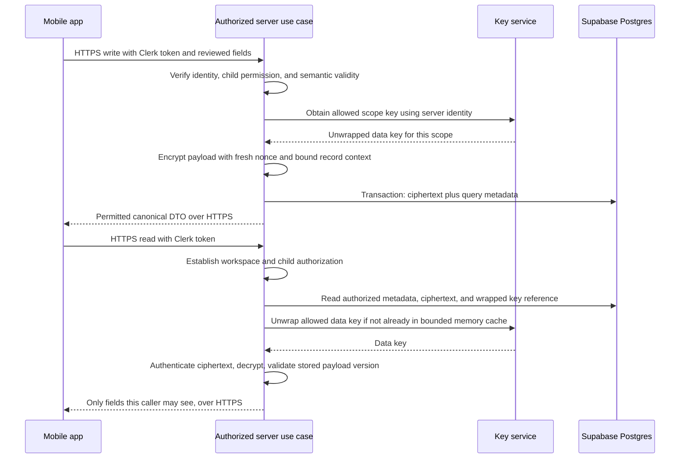

# Encryption of personal data in Postgres

Required architecture change, September 6, 2026. Implement this from milestone 1, before storing real personal information. This is an implementation specification; encryption is not running in this documentation-only repository.

## Decision and threat boundary

Encrypt personal profiles and sensitive care content in the application **before** sending SQL writes to Supabase. Authenticate and authorize a read **before** the server unwraps keys and decrypts the selected records. Return only permitted DTO fields over HTTPS; the mobile app never receives the database encryption keys.

Use envelope encryption: a random AES-256 data encryption key (DEK) for each workspace, wrapped by a key encryption key (KEK) kept outside Postgres. Global user profile data uses a user-scoped DEK. Use authenticated encryption, AES-256-GCM, from a supported cryptographic library. Key separation and authenticated modes follow [OWASP storage guidance](https://cheatsheetseries.owasp.org/cheatsheets/Cryptographic_Storage_Cheat_Sheet.html); envelope key handling follows the [AWS KMS model](https://docs.aws.amazon.com/kms/latest/developerguide/concepts.html).

This protects the covered content in SQL dumps, database backups, and database-only compromise when the attacker lacks key-service/application access. It does not make metadata anonymous, prevent an authorized user from seeing data, or protect plaintext from a compromised server that can legitimately decrypt it. This is server-side application encryption, not end-to-end encryption.

Encryption supplements Clerk, child authorization, tenant RLS, private storage, TLS, and retention. None of those controls should be removed because ciphertext exists.

## Write and read flow



The database receives ciphertext and wrapped DEKs, not raw DEKs or the KEK. No SQL decryption function, database trigger, or Drizzle custom column mapper may automatically decrypt values during arbitrary reads. Explicit authorized use cases control decryption, and repositories accept encrypted persistence objects for protected columns.

For ordinary writes, resolve the scope key and encrypt before opening a transaction where possible. Recheck authorization/version/status in the committing transaction. Operations that need a consistent decrypted snapshot can preload the required authorized keys and then perform bounded local crypto inside their existing transaction. Do not perform slow remote KMS calls while holding child locks; fetch a missing key and retry the read/transaction safely if necessary.

## Protected fields and physical storage

API and domain values remain readable types in server memory. The physical database uses the following encrypted columns; do not keep a second plaintext column for convenience.

| Table | Encrypted column and decrypted payload | Queryable metadata retained |
| --- | --- | --- |
| `users` | `profile_ciphertext`: display name | Local UUID, Clerk subject ID, account/notice status |
| `workspaces` | `profile_ciphertext`: workspace display name | UUID, Clerk org ID, kind, timezone, quotas/status |
| `children` | `profile_ciphertext`: name and optional birthdate | Workspace/child UUIDs, creator, journal counter, status |
| `invitation_intents` | `invitee_ciphertext`: normalized email | IDs, role, state/expiry, keyed email lookup value |
| `captures` | `content_ciphertext`: raw transcript, formatted text, editable draft | IDs, author, input kind, time/locale, versions, state, provider/model references |
| `events` | `payload_ciphertext`: amount, unit, and type-specific details/notes | IDs, kind, occurrence/end times, timezone, time precision, important flag, state/version |
| `event_revisions` | `content_ciphertext`: full revision snapshot and source quote | IDs, child journal sequence, event version, operation, actor, source span offsets |
| `handoff_briefs` | `snapshot_ciphertext`: entire brief snapshot, text, context, source references | IDs, recipient, cursor boundaries, renderer version, acknowledgement/state |
| `idempotency_requests` | `response_ciphertext`: canonical response fields when persistence is needed | Actor, operation/key, encryption scope, request HMAC, status/expiry |

Opaque IDs, role/relationship links, care categories, timestamps, and object paths can still be sensitive or linkable. They remain queryable as a deliberate metadata tradeoff for the current access model and timeline. Do not claim that every identifying association is hidden from a database administrator. Expanding encryption to that metadata would require another query/index design.

Provider checkpoint text must be inside the encrypted capture, never copied into `jobs.checkpoint`. Jobs and audit records keep only approved IDs, operation names, safe status/error codes, and counters. Webhook inbox rows keep the verified event/resource IDs and minimal lifecycle facts needed to reconcile; do not store Clerk's complete raw body containing names/emails. If future functionality needs raw webhook/provider material, classify and encrypt it explicitly first.

Never persist signed URLs in idempotent responses. Save canonical IDs/status and issue fresh scoped upload/read authorization on an authorized replay. A revoked caller cannot replay an old response to recover private content. Use a keyed request fingerprint for payloads with low-entropy personal values; an ordinary hash is not sufficient protection against guessing.

## Ciphertext envelope

Each encrypted column is a validated JSONB envelope containing only:

```json
{
  "formatVersion": 1,
  "algorithm": "A256GCM",
  "keyId": "opaque-data-key-uuid",
  "nonce": "base64-encoded-12-byte-nonce",
  "ciphertext": "base64-encoded-ciphertext",
  "tag": "base64-encoded-16-byte-authentication-tag"
}
```

This is an illustrative shape, not a usable cryptographic value. Validate lengths and allowlisted versions/algorithm before decryption. Generate a fresh 96-bit nonce using a cryptographically secure RNG for every encryption, including retry re-encryption; never derive it from the child ID, timestamp, or event version. Use a 256-bit random DEK and a full 128-bit GCM tag. Set a conservative per-key encryption usage budget and rotate well before the library's documented limits; the initial proposed budget is one million encryptions per DEK.

Bind authenticated additional data (AAD) to a canonical, versioned encoding of application identifier, scope kind/ID, table, row ID, encrypted column, envelope format version, and key ID. For a composite primary key, use a canonical encoding of that full key as the row identity. Construct AAD from server-expected context. A copied child ciphertext must fail when used in another row, column, or workspace. Do not include mutable `updated_at` or current event version unless every corresponding change re-encrypts that field. Do not include plaintext names or emails in AAD or KMS context.

Use the library's authenticated decryption finalization before releasing any plaintext; do not stream unauthenticated bytes to callers. On authentication/tag failure, unsupported envelope, unavailable key, or missing authorization, fail closed with a safe error and preserved ciphertext. Never return partial text, fall back to a legacy plaintext field, or overwrite the encrypted value with null. [Node crypto primitives and authenticated decryption](https://nodejs.org/api/crypto.html)

The decrypted payload contains its own `schemaVersion`. Cipher envelope version, payload schema version, entity edit version, and model/prompt version are separate concepts.

## Keys and access

Production default: managed AWS KMS wrapping key, using a dedicated server workload identity. This is an added infrastructure dependency/cost. The environment contains the approved KMS key reference and region, not a raw production KEK. Restrict IAM to the required key and operations; separate production from development and separate key administration from application usage.

For local/synthetic development only, a local wrapping adapter may use a random base64 KEK injected as `PII_DEV_WRAPPING_KEY_B64`. Keep it outside source control/database and reject this adapter in production. Never generate a new replacement key on startup when configuration is missing: that would strand existing data. Tests use isolated disposable keys.

Add `data_keys` to the internal schema:

- `id uuid PK`, nullable `workspace_id` FK, nullable `user_id` FK, `purpose content|lookup`, `version int`, `wrapped_key bytea`, `wrapping_provider`, `wrapping_key_ref`, `wrapping_context_version`, `state active|decrypt_only|retired`, `reserved_encryptions bigint DEFAULT 0`, timestamps.
- Check exactly one of workspace/user ID is set. Use separate partial unique indexes for active `(workspace_id,purpose)` and `(user_id,purpose)` keys and unique version-per-scope/purpose constraints.
- Key IDs are opaque. Raw data keys are never stored. Wrapped bytes are produced/consumed by the configured key provider; do not accept arbitrary key-service URLs or key ARNs from a ciphertext header.
- Bind key wrapping/unwrapping to the expected scope/purpose using KMS encryption context. Context is metadata and may appear in key-service audit records, so it contains no plaintext PII.
- Concurrent first-use provisioning creates a single active key per scope/purpose. Insert wrapped key records and source entity records with transactional consistency; discard an unpersisted losing candidate rather than exposing two active versions.
- Reserve encryption usage against the active content-key row atomically before generating new ciphertext; rotate instead of exceeding its budget. Failed business writes may consume an unused reservation, which is safe. A cached decrypt-only key must never be selected for new encryption.

The server reauthorizes each operation even if its DEK is in memory. A bounded short-lived cache (initial target 60 seconds, capped by entries) avoids a KMS call for every small row. Do not persist it, share it with the mobile client, or imply that garbage collection guarantees memory erasure.

User-profile decryption is restricted to the authenticated user's profile and named-person displays authorized through visible care records or membership management. There is no general endpoint to decrypt arbitrary user IDs. An extraction worker receives only the authorized capture payload, not roster or user-profile data. KMS alone does not enforce per-child permissions when multiple children share a workspace key; the application must still enforce them.

## Exact invitation lookup without plaintext email

Keep the actual email encrypted. For equality lookup and pending-invite uniqueness, store `email_lookup_hash = HMAC-SHA-256(workspaceLookupKey, purpose + workspaceId + canonicalEmail)` with `email_lookup_key_id`. Use unambiguous canonical encoding and one documented email normalization policy matching the verified-identity flow. No raw email appears in the index.

Use a separate random workspace lookup key, wrapped like a DEK with `purpose=lookup`; never use the data encryption key or plain SHA-256(email). Use the corresponding scope's lookup key with a distinct `request-fingerprint` domain label for idempotency fingerprints. An HMAC index still reveals equality within its scope and is not anonymous. A hash match is only a candidate lookup: verify/decrypt the invite and establish the Clerk recipient/membership before granting anything.

Keep lookup keys stable through ordinary content-key rotation; KEK rotation rewraps them without changing lookup values. If a lookup key itself must change, serialize/temporarily pause invitation mutations for that workspace, rebuild all active lookup values from authorized decrypted rows, and atomically switch the active key under the workspace lock. Do not allow a transition to create duplicate pending invitations under different index keys. Include request-fingerprint key changes in the idempotency retention/rotation plan.

## Query behavior and validation

Postgres continues to filter by workspace/child, permissions, event kind, timestamps, status, and journal sequence. Fetch bounded authorized rows, decrypt them in the server, validate payload shapes, and build the existing API DTOs. No change to the mobile app's display contract is required merely because persistence is encrypted.

Amounts, birthdates, free text, and names cannot be sorted, searched, aggregated, or checked as plaintext in SQL. Remove SQL checks on encrypted amount/unit pairs; enforce their existing rules in server domain validation before encryption and after decryption. Keep SQL checks on visible metadata, foreign keys, revision uniqueness, and time ordering. The server is the only permitted writer for protected rows.

For a small roster, paginate by stable metadata, decrypt the authorized page/list, and sort within the defined UI scope; do not promise globally sorted encrypted names across independently paginated pages. MVP has no database full-text search over encrypted notes/transcripts. Design an explicit, reviewed search/index strategy only if that feature is later required.

Brief construction decrypts authorized revisions within the bounded snapshot flow, renders in server memory, then encrypts the new stored brief. Encryption rotation can replace a revision's ciphertext envelope without changing its logical snapshot, journal sequence, or event version; audit this as maintenance, not a care correction. Revocation/deletion still invalidates reads of stored brief content.

## Rotation, recovery, and deletion

- KEK rotation/rewrapping changes wrapped key records without rewriting every data row. Retain the ability to unwrap historical records during migration.
- DEK rotation marks the old key decrypt-only, creates a new active key, and uses it for new writes. A resumable worker re-encrypts older envelopes with version/old-envelope checks so it cannot overwrite concurrent edits. Readers support both versions during rollout.
- Retire a DEK only after live rows, idempotent responses, snapshots, retained backup requirements, and recoverability have been checked. An old backup can require an old key even after live rotation finishes.
- Database backup and key recovery are separate requirements. Test restore into an isolated environment and authorized decryption of known fixtures. Losing every copy of the usable key makes its data unrecoverable.
- Child deletion removes its objects, profiles, captures, events, revisions, and brief copies. Do not delete a workspace DEK when only one child is deleted. A shared workspace key does not provide individual child cryptographic erasure from historical backups.
- Workspace deletion can retire its scope keys after the agreed retention/recovery policy, but do not claim instant irreversible erasure while recoverable wrapped-key backups and KMS access still exist. User-profile keys follow the separate account policy.

## Other copies and deliberate limits

Database field encryption does not automatically encrypt object bytes, Clerk's own identity store, ASR/LLM provider systems, mobile files, or server memory. Keep private object access/retention and provider due diligence in the base architecture. A separate encrypted-media design would change direct uploads, signed downloads, and playback; it is not silently delivered by this database change.

Do not persist decrypted server query caches in mobile SQLite. The current upload outbox should hold minimal IDs/state/file references. If locally persisted draft text is added, it needs device-local encryption with a securely stored device key and its own logout/recovery policy; never reuse or deliver the server DEK. Pending audio files retain the platform/file-protection limits described in the mobile design until encrypted local media is explicitly implemented.

Disable sensitive request/response/query tracing. Redact crash reports and provider debug logs. Use `Cache-Control: no-store` for PII API responses and keep decrypted display state scoped to the signed-in user in memory. The application can send permitted transcript content to an AI provider for processing; encryption at rest does not conceal that processing from the provider.

## Required verification

1. Synthetic profile, email, birthdate, note, amount, transcript, revision, and brief markers do not appear in plaintext database dumps, inbox/job checkpoints, idempotency rows, or logs.
2. Authorized reads round-trip correctly; another child/tenant/user cannot trigger decryption or receive plaintext. Reader/author restrictions on captures still apply.
3. Altered nonce/tag/ciphertext, swapped rows/columns/scopes, missing keys, unsupported versions, and key-service failure all fail closed.
4. Concurrent writes and worker retries preserve version/idempotency semantics. Encryption failure rolls back publication rather than storing cleartext.
5. Invitation equality/deduplication works with encrypted emails; lookup-key migration blocks cross-version duplicates.
6. KEK/DEK rotation supports old and new records; a resumed re-encryption job does not overwrite a user's correction or create new care revisions.
7. Backup recovery and child/workspace purge are exercised with keys and encrypted copies, not just row counts.
8. Crypto uses the pinned runtime/library, independently specified test vectors where applicable, and integration fixtures. Production readiness includes review of the implementation/key permissions, not just successful encrypt/decrypt examples.
